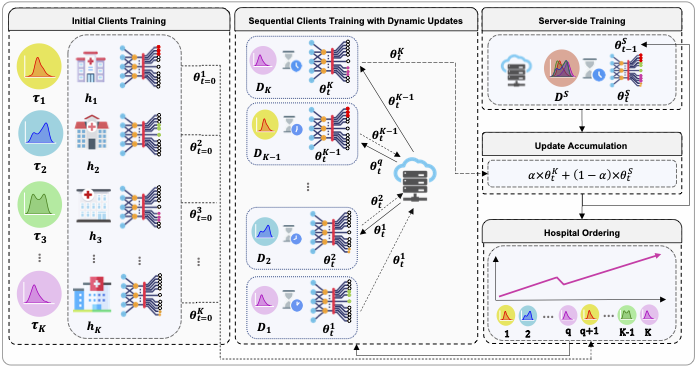

# 𝐔𝐧𝐢𝐅𝐞𝐝: 𝐀 𝐔𝐧𝐢𝐯𝐞𝐫𝐬𝐚𝐥 𝐅𝐞𝐝𝐞𝐫𝐚𝐭𝐢𝐨𝐧 𝐨𝐟 𝐚 𝐌𝐢𝐱𝐭𝐮𝐫𝐞 𝐨𝐟 𝐇𝐢𝐠𝐡𝐥𝐲 𝐇𝐞𝐭𝐞𝐫𝐨𝐠𝐞𝐧𝐞𝐨𝐮𝐬 𝐌𝐞𝐝𝐢𝐜𝐚𝐥 𝐈𝐦𝐚𝐠𝐞 𝐂𝐥𝐚𝐬𝐬𝐢𝐟𝐢𝐜𝐚𝐭𝐢𝐨𝐧 𝐓𝐚𝐬𝐤𝐬
This repository provides the official implementation of our UniFed model accepted to [MLMI-MICCAI-2024](https://sites.google.com/view/mlmi2024/home).

## 🔎 𝐖𝐡𝐚𝐭 𝐢𝐬 𝐔𝐧𝐢𝐅𝐞𝐝?
UniFed is a novel federated learning framework that learns from a mixture of highly heterogeneous tasks by introducing a loss-guided dynamic and sequential model exchange between the server and clients with application to medical image classification. We further remedy the variance in convergence time across clients during our sequential exchange process while being agnostic to task complexity. 

## 🏆 𝐎𝐮𝐫 𝐀𝐜𝐡𝐢𝐞𝐯𝐞𝐦𝐞𝐧𝐭
Our experiment has shown the outperformance of UniFed on various medical imaging datasets including OCTMNIST, OrganAMNIST, and TissueMNIST datasets derived from the [MedMNIST](https://medmnist.com/) dataset with classification tasks under both strongly and moderately Non-IID data splits, and showing improvement in communication cost and convergence time over relevant baselines.

##   Overview
This is an overview of UniFed framework.

## Datasets

## Installation